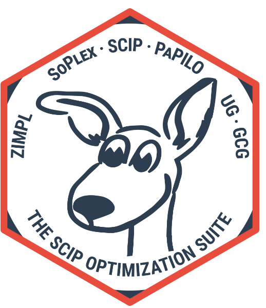

<!-- README.md is generated from README.Rmd. Please edit that file -->

```{r, include = FALSE}
knitr::opts_chunk$set(
  collapse = TRUE,
  comment = "#>",
  fig.path = "man/figures/README-",
  out.width = "100%"
)
```

# SCIP 

<!-- badges: start -->
[](https://github.com/bnaras/scip/actions/workflows/R-CMD-check.yaml)
<!-- badges: end -->

This is an R interface to the SCIP Optimization Suite (2025,
<doi:10.48550/arXiv.2411.14927>).  [SCIP](https://www.scipopt.org/) is
one of the fastest non-commercial solvers for mixed integer
programming (MIP) and mixed integer nonlinear programming (MINLP). It
is also a framework for constraint integer programming and
branch-cut-and-price. It allows for total control of the solution
process and the access of detailed information down to the guts of the
solver.

## Installation

Install the released version from CRAN:

```{r, eval = FALSE}
install.packages("scip")
```

Or install the development version from GitHub:

```{r, eval = FALSE}
# install.packages("pak")
pak::pak("bnaras/scip")
```

## Usage

Refer to the vignettes for examples. However, one of the easiest way
to use this and many other solvers is via
[`CVXR`](https://cvxr.rbind.io) (version 1.8.2 and higher).


## License

Apache License 2.0
